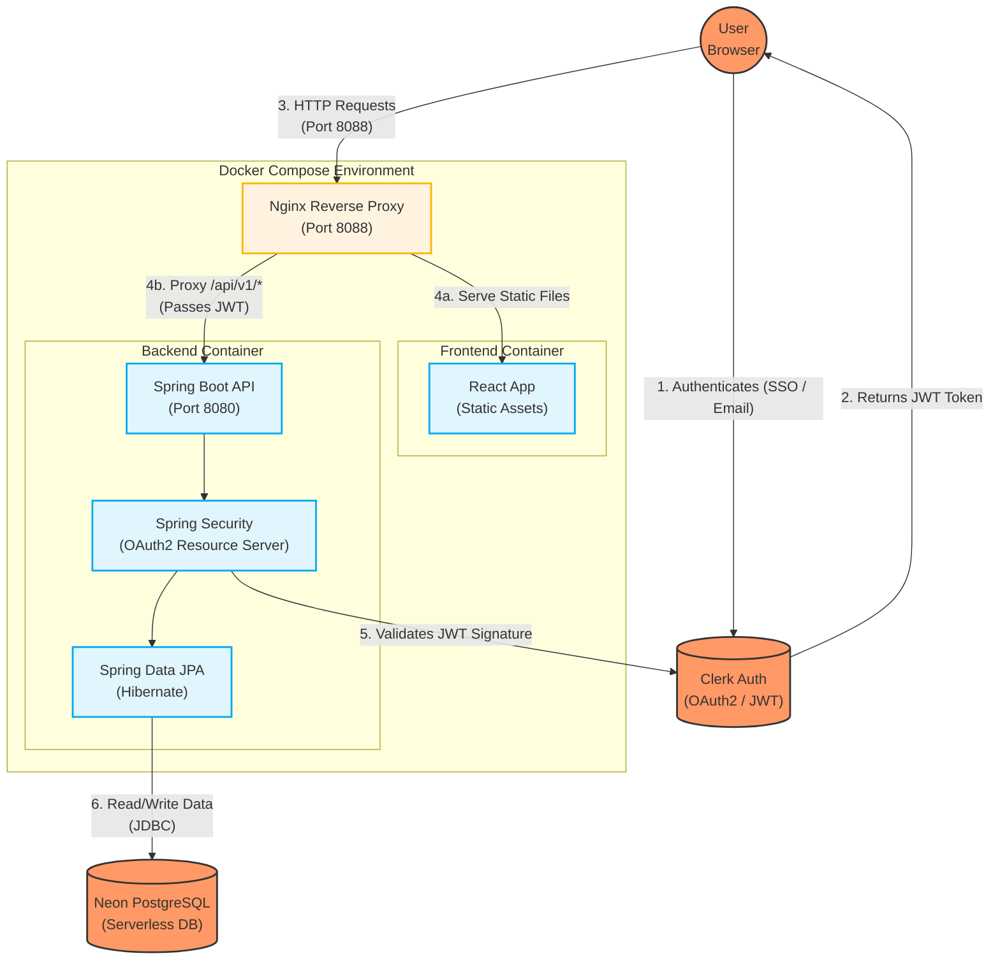

# 🌿 Botanical Bliss

A full-stack e-commerce application for plant enthusiasts, built with modern technologies and containerized for seamless deployment.

---

## 🌱 About the Project

**Botanical Bliss** is a robust, end-to-end e-commerce platform designed for selling plants and gardening products. Originally based on a generic storefront template, this project has been heavily customized, rebranded, and architecturally overhauled to be a lightweight, secure, and modern web application.

The core objective of the project is to provide a frictionless shopping experience for users while maintaining an incredibly secure and performant backend. It completely decouples the frontend presentation layer from the backend business logic, relying on industry-standard stateless authentication.

### Key Project Pillars
1. **Frictionless Checkout**: Recognizing that complex payment gateways (like Stripe) can cause friction in certain markets, the platform utilizes a streamlined **Cash on Delivery** ordering system. Users can build their cart, optionally apply promotional discount codes, and place orders instantly without needing a credit card.
2. **Stateless Security**: The application relies on **Clerk** for OAuth2 authentication. Instead of managing sensitive passwords and JWT rotation logic internally, Clerk handles the heavy lifting of user sessions. The Spring Boot backend acts as a strict OAuth2 Resource Server, validating JWT signatures statelessly on every request.
3. **Containerized Portability**: The entire stack is orchestrated via Docker Compose. The React frontend is pre-built into static assets and served by an ultra-fast Nginx reverse proxy, which also routes API traffic directly to the Spring Boot backend, completely eliminating CORS complexities.
4. **Cloud-Native Database**: The application is wired to securely connect to a remote serverless **Neon PostgreSQL** database, removing the need for heavy local database containers and ensuring data persists securely off-site.

---

## 🏗️ Architecture

Below is a detailed Mermaid diagram illustrating how data and requests flow through the Botanical Bliss architecture.



### Flow Explanation:
1. **User Authentication**: The user logs in via Clerk's managed UI components in the React frontend. Clerk issues a secure JWT to the browser.
2. **Reverse Proxying**: All traffic goes to **Nginx** on port `8088`. Nginx intelligently routes requests. If the user asks for a webpage, it serves the React static files. If the user makes an API request (to `/api/v1/*`), Nginx proxies it to the backend container.
3. **Stateless Validation**: The Spring Boot backend receives the proxied API request. Spring Security intercepts it, extracts the JWT, and validates it against Clerk's public JWK set (JSON Web Key Set). If valid, the request proceeds.
4. **Data Persistence**: The Spring Data JPA layer executes the business logic (like creating an order) and communicates with the remote Neon PostgreSQL database.

---

## ⚡ Quick Start

1. **Configure environment variables**:
   Create a `.env` file in the root directory based on `.env.example` and fill in your keys (especially the `CLERK_ISSUER_URI` and `DATABASE_URL`).

2. **Start the application**:
   ```bash
   docker-compose up -d --build
   ```

3. **Access the application**:
   - **Application**: [http://localhost:8088](http://localhost:8088)
   - **API Endpoint**: `http://localhost:8088/api/v1`

---

## 🛠️ Tech Stack

### Infrastructure
- **Nginx Reverse Proxy** - Single entry point and static file serving
- **Docker & Docker Compose** - Container orchestration

### Frontend
- **React 19** with modern hooks
- **Vite** for fast development and building
- **Tailwind CSS** for responsive styling
- **Redux Toolkit** for state management
- **Clerk React SDK** for authentication

### Backend
- **Spring Boot 3.5** with Java 21
- **Spring Security** with stateless OAuth2 Resource Server
- **Spring Data JPA** with Hibernate
- **PostgreSQL** database (configured for Neon serverless Postgres)

---

## 🌟 Key Features

- **Authentication**: Secure OAuth2 login and profile management using Clerk.
- **Shopping Experience**: Browse plants, manage a shopping cart, and use optional discount codes.
- **Checkout**: Frictionless Cash on Delivery ordering system.
- **Admin Dashboard**: Manage products, orders, and user roles seamlessly.
- **Robust Security**: Stateless API design with no CSRF vulnerabilities, tightly controlled CORS via Nginx.

---

## 📁 Project Structure

```text
botanical-bliss-store/
├── pandac-store-backend/       # 🌐 Spring Boot API (Java 21)
├── botanical-bliss-store-ui/   # 🖥️ React frontend (Vite)
├── docker-compose.yml          # 🐳 Container orchestration
├── .env                        # ⚙️ Environment variables
└── README.md                   # 📖 This file
```

---

## 🚀 Development Commands

```bash
# Start all services and build images
docker-compose up -d --build

# View real-time logs for all services
docker-compose logs -f

# View logs for a specific service (e.g., backend)
docker-compose logs -f backend

# Stop all services
docker-compose down
```

---

Happy gardening! 🌱
